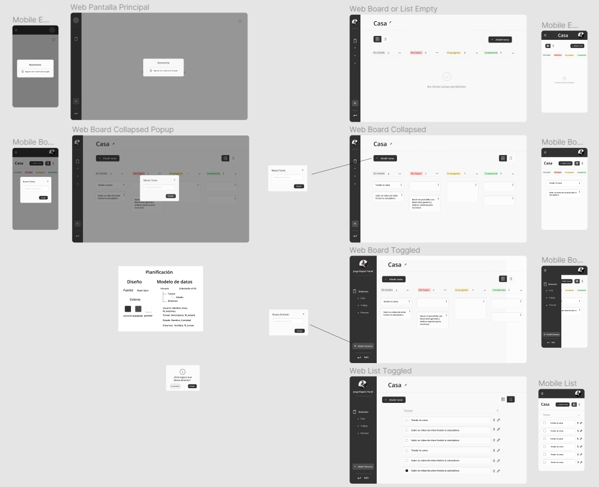
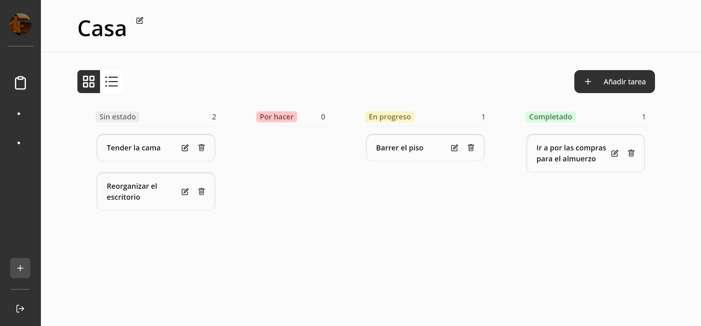
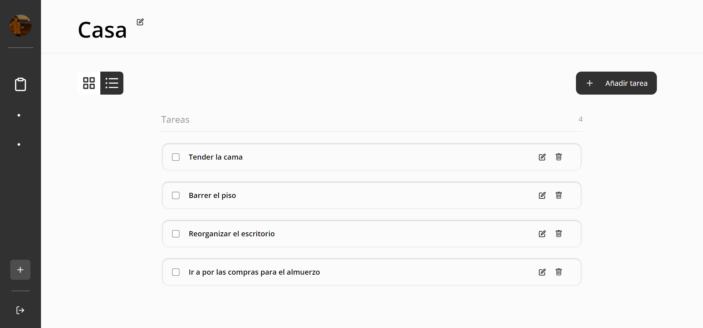

# React-Typescript To-Do  #

## Presentación 👋

Hola :) me alegra que vengas a este repositorio, este contenido ha sido realizado como práctica personal para estas tecnologías.

Mi práctica consistió en construir una aplicación de tareas.
El diseño lo realicé yo mismo y es el siguiente: 

- Diseño:
  

## Muestra 👀

La aplicación tiene ingreso con Google y varios CRUDS.
Tiene también un sistema de estados para ir cambiando las tareas de acuerdo al progreso
utilizando drag n' drop.

Acá pueden ver cómo funciona la aplicación: 

[Enlace a la aplicación](https://rt-todo.vercel.app/)

- Board View: 

- List View: 
  

## Comencemos 🚀

Para empezar ejecutemos los siguientes comandos en ese orden:
~~~
git clone https://github.com/JorgeRojas827/rt-todo

cd rt-todo

npm i
~~~

Y listo, puedes probar y jugar con el código :)

## Construido con 🛠️

- ### React JS
- ### Typescript
- ### Tailwind CSS
- ### Redux Toolkit
- ### Axios
- ### Framer Motion
- ### React Beautiful DnD
- ### React Hook Form
- ## More

## Licencia 📄

Este proyecto está bajo la Licencia (MIT).

## ⌨️ con ❤️ por Jorge Rojas 🙌
